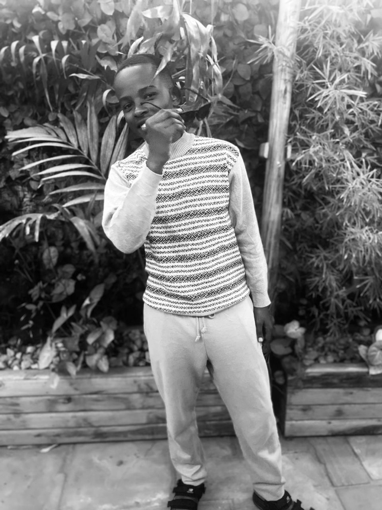

<!DOCTYPE html>
<html lang="en">
<head>
    <meta charset="UTF-8">
    <meta name="viewport" content="width=device-width, initial-scale=1.0, maximum-scale=5.0">
    <title>NSHUTI Emmanuel - Home</title>
    <link rel="icon" href="target.gif">
    <link rel="stylesheet" href="https://cdnjs.cloudflare.com/ajax/libs/font-awesome/6.4.0/css/all.min.css">
    <link rel="stylesheet" href="style.css">
    
</head>
<body>
    

        <i class="fas fa-moon"></i>
        <i class="fas fa-sun"></i>
    

    <header>
        

            <a href="index.html" class="logo">NSHUTI.</a>
            
            

                <ul class="nav-links" id="navLinks">
                    <li><a href="index.html" class="active">Home</a></li>
                    <li><a href="about.html">About</a></li>
                    <li><a href="education.html">Education</a></li>
                    <li><a href="projects.html">Projects</a></li>
                    <li><a href="contact.html">Contact</a></li>
                </ul>
            

            
            

            

            
            

                <i class="fas fa-bars"></i>
            

        

    </header>

    <section class="hero">
        

            

                

                    <h1>NSHUTI Emmanuel</h1>
                    <h3>IT Student & Aspiring </h3>
                    
I am a passionate IT student at King David Academy with expertise in programming languages like C++ and C, web development with HTML, CSS, JavaScript, and cybersecurity. Based in Rubavu, Rwanda, I'm dedicated to becoming a skilled software developer and ethical hacker.

                    
My journey in technology started with curiosity about how software works, and now I'm pursuing it seriously to solve real-world problems through secure and efficient software solutions.

                    

                        <a href="projects.html" class="btn">View My Work</a>
                        <a href="contact.html" class="btn btn-secondary">Contact Me</a>
                    

                

                

                    

                        
                        

                            <i class="fas fa-user"></i>
                        

                    

                

            

        

    </section>

    <section class="quick-links">
        

            <h2>Explore My Portfolio</h2>
            

                <a href="about.html" class="link-card">
                    

                        <i class="fas fa-user"></i>
                    

                    <h3>About Me</h3>
                    
Learn about my skills, background, and what drives me in technology

                </a>
                
                <a href="education.html" class="link-card">
                    

                        <i class="fas fa-graduation-cap"></i>
                    

                    <h3>Education</h3>
                    
See my academic journey and career goals at King David Academy

                </a>
                
                <a href="projects.html" class="link-card">
                    

                        <i class="fas fa-code"></i>
                    

                    <h3>Projects</h3>
                    
View my programming projects and web development work

                </a>
                
                <a href="contact.html" class="link-card">
                    

                        <i class="fas fa-envelope"></i>
                    

                    <h3>Contact</h3>
                    
Get in touch with me for opportunities or collaboration

                </a>
            

        

    </section>

    <footer>
        

            

                

                    
NSHUTI.

                    
IT Student at King David Academy passionate about software development and cybersecurity

                

                

                    <h3>Quick Links</h3>
                    <ul>
                        <li><a href="index.html" class="footer-link">Home</a></li>
                        <li><a href="about.html" class="footer-link">About</a></li>
                        <li><a href="education.html" class="footer-link">Education</a></li>
                        <li><a href="projects.html" class="footer-link">Projects</a></li>
                        <li><a href="contact.html" class="footer-link">Contact</a></li>
                    </ul>
                

                

                    <h3>Connect</h3>
                    

                        <a href="https://github.com/nshutiemmanuel860-coder/" target="_blank" class="social-icon"><i class="fab fa-github"></i></a>
                        <a href="https://www.linkedin.com/feed/" target="_blank" class="social-icon"><i class="fab fa-linkedin"></i></a>
                        <a href="https://www.instagram.com/nshuti__wagakira/" target="_blank" class="social-icon"><i class="fab fa-instagram"></i></a>
                        <a href="mailto:nshutiemmanuel860@gmail.com" class="social-icon"><i class="fas fa-envelope"></i></a>
                    

                

            

            

                
&copy;  NSHUTI Emmanuel. All Rights Reserved.

                
Phone: +250 783805137 | Location: Rubavu, Rwanda

            

        

    </footer>

    

        <i class="fas fa-arrow-up"></i>
    

    
</body>
</html>
